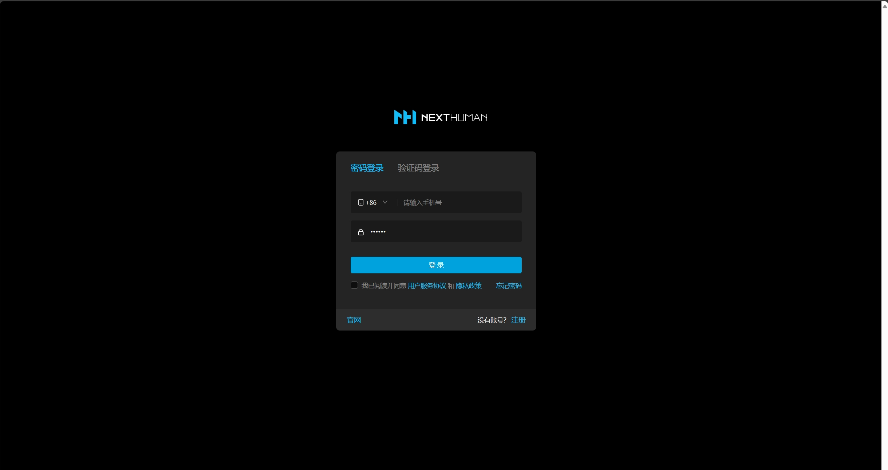
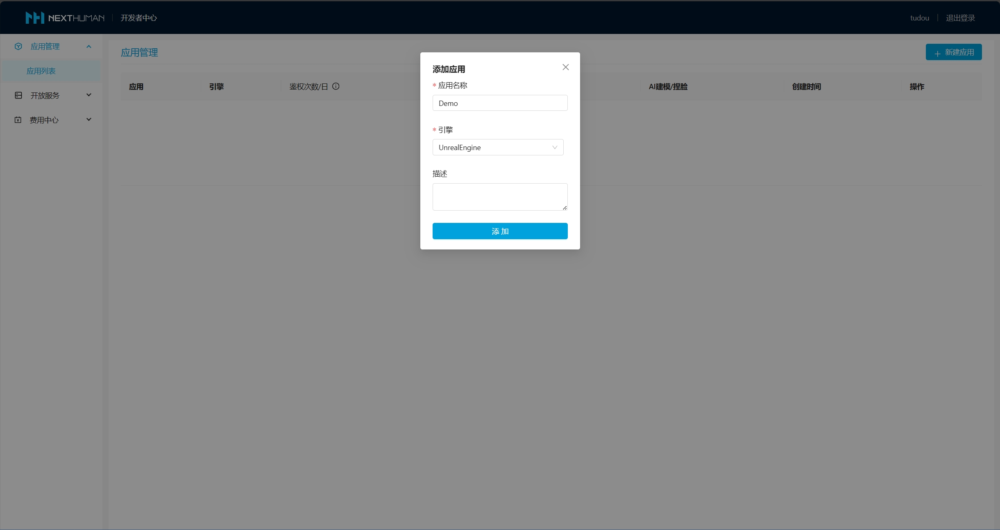
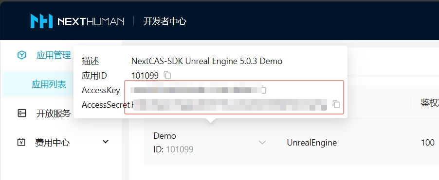
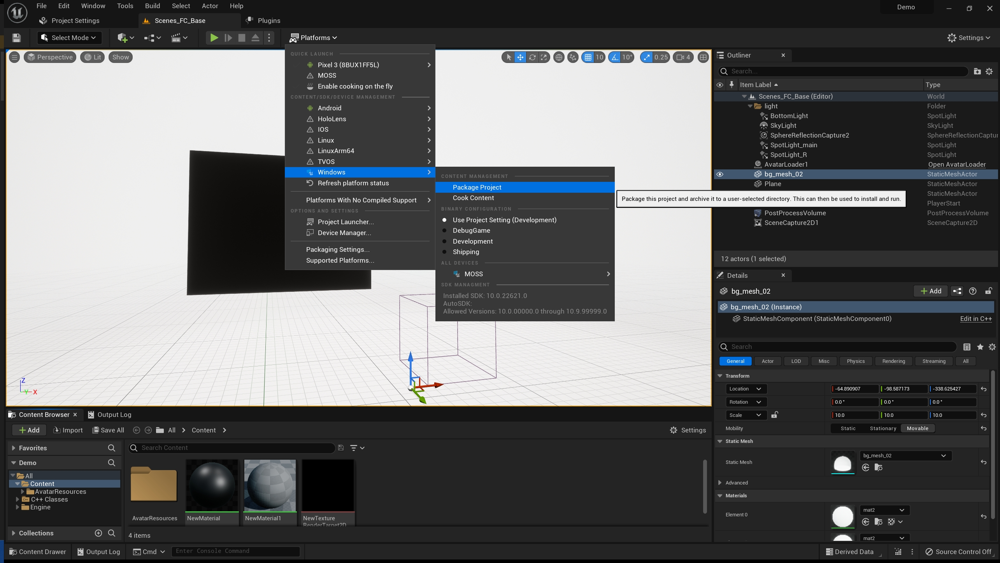

### NextCAS-SDK说明
1. 基于虚幻引擎5.0.3，提供运行时的C++接口。该系列接口实现了虚拟人的加载、表情、动画、换装、捏脸、AI问答等功能。

### 开发环境推荐配置
1. Windows 10/11
2. Visual Studio 2022/JetBrains Rider 2023
3. 虚幻引擎（Unreal Engine）5.0.3

### SDK部署
1. [请联系商务](https://nexthuman.cn/wiki/home)。
2. 解压到虚幻引擎插件目录下，例如：Engine\Plugins\Marketplace\NextCAS-SDK\NextCAS-SDK.uplugin

### 获取鉴权令牌
1. 注册登录[开发者中心](https://nexthuman.cn/developer/#/login)。
2. 创建应用。
3. 获取AccessKey和AccessSecret。
4. 生成鉴权令牌的步骤参考[WebGL文档](https://nexthuman.cn/developer/#/open/docs/js)中鉴权部分。

### Demo使用说明
 1. [获取Demo](https://github.com/WeHome007/NextCAS)
    git pull 
 2. 打包项目
 3. 启动项目：
    Demo.exe -at "AccessToken" [-aid "AvatarId"] [-q "Question"]
    -at: 使用“获取鉴权令牌”步骤中生成的令牌
    -aid: 形象ID。参数不输入则使用默认值，具体看Demo代码。
    -q：Demo启动后，向虚拟人提的问题。

### 项目集成说明
#### 项目设置
##### 1. DefaultEngine.ini中确保以下设置：
    [/Script/Engine.RendererSettings]
    r.GPUSkin.Support16BitBoneIndex=True
    r.GPUSkin.UnlimitedBoneInfluences=True
    r.SkinCache.BlendUsingVertexColorForRecomputeTangents=2
    r.SkinCache.CompileShaders=True
    r.SkinCache.DefaultBehavior=0

##### 2. DefaultGame.ini中确保以下设置：
    [/Script/UnrealEd.ProjectPackagingSettings]
    UsePakFile=True
    bUseIoStore=False
    bUseZenStore=False
    bShareMaterialShaderCode=False
    bSharedMaterialNativeLibraries=False

##### 3. 项目的uproject文件中添加：
	"Plugins": [
		{
			"Name": "NextCAS-SDK",
			"Enabled": true
		}
	]

##### 4. 引入虚拟人模块：
    PrivateDependencyModuleNames.AddRange(new string[] { 
        "NextHumanSDK", // 虚拟人
        "NextAgent"     // AI问答
    });

#### 初始化
    #include "INextHumanSDK.h"
    #include "NHError.h"

	INextHumanSDKModule::Get().Initialize(AccessToken, [=](int32 Code, const FString& Message) {
		if (Code == FNHError::SUCCESS) {
            // 初始化成功
		} else {
            // 初始化失败, Message包含错误信息
        }
	});

#### 创建虚拟人
    #include "NextAvatar.h"

    ANextAvatar* Avatar = World->SpawnActor<ANextAvatar>(FVector(0, 0, 0), FRotator(0, 0, 0));
    Avatar->SetAvatarId(AvatarId, [=](int32 Code, const FString& Message, TMap<FString, ANextAvatar::FBundleInfo> BundleInfos) {
    });

#### 虚拟人对话初始化
    #include "NHAgentComponent.h"

    UNHAgentComponent* Agent = Cast<UNHAgentComponent>(Avatar->GetComponentByClass(UNHAgentComponent::StaticClass()));
    if (!Agent) {
        Agent = NewObject<UNHAgentComponent>(Avatar);
        Agent->ComponentTags.Add(TEXT("CtrlFBF"));
        Agent->RegisterComponent();
        Agent->AttachToComponent(Avatar->GetRootComponent(), FAttachmentTransformRules::KeepRelativeTransform);
        Agent->OnAnswer().BindLambda([=](nexthuman::sdk::FNHError Result, const FString& Text) {
        });
    }

#### 虚拟人对话
    Agent->Ask(Question);

#### 虚拟人换装
测试中

#### 虚拟人捏脸
测试中
