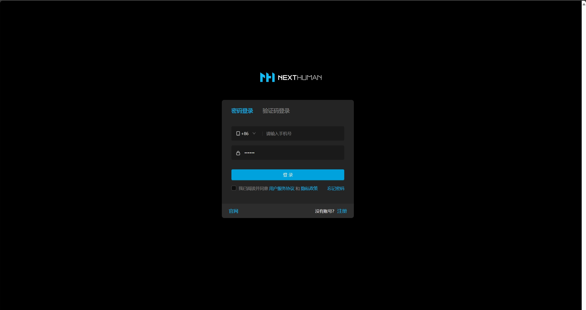
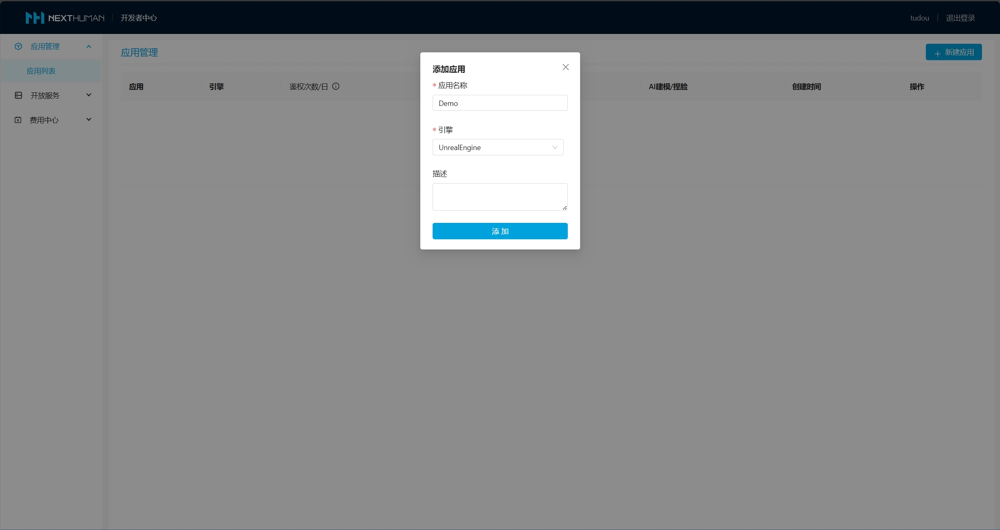
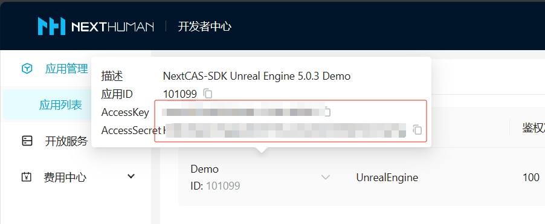
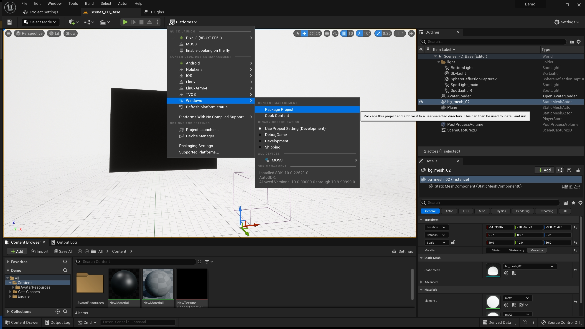
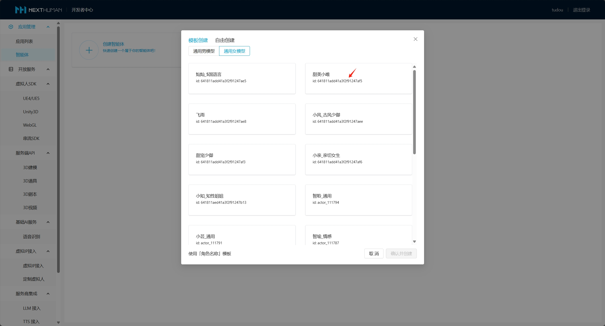

</img>

# NextHuman 超写实数字人

### NextCAS-UE说明
1. 基于虚幻引擎5.0.3，提供运行时的C++接口。该系列接口实现了虚拟人的加载、表情、动画、换装、捏脸、AI问答等功能。

### 开发环境推荐配置
1. Visual Studio 2022/JetBrains Rider 2023
2. Windows SDK 10.0.22621.0
3. MSVC v143 - VS 2022 C++ x64/x86 build tools 14.35.32215 ([不要使用MSVC v143 14.39](https://forums.unrealengine.com/t/unreal-engine-5-4-preview/1763516))
3. 虚幻引擎（Unreal Engine）5.0.3

### SDK部署
1. 请联系我们：  <br/>
</img><br/>
2. https://pan.baidu.com/s/1CGra1nI5MLpk8z2EWDzfAA?pwd=5mob
  插件：NextCAS-SDK_2025_03_21.zip
  Demo的可执行文件：Demo_2025_03_21.zip
3. 解压到虚幻引擎安装目录中的插件目录下，例如：
D:\UE_5.0\Engine\Plugins\Marketplace\NextCAS-SDK\NextCAS-SDK.uplugin

### 获取鉴权令牌
1. 注册登录[开发者中心](https://nexthuman.cn/developer/#/login)。
2. 创建应用。
3. 获取AccessKey和AccessSecret。
4. 生成鉴权令牌的步骤参考[文档](https://nexthuman.cn/developer/#/open/docs/ue)中鉴权部分
5. !!!注意每次SDK重新初始化或/刷新页面，请重新生成Token(避免被盗用和滥用)!!!

### Demo使用说明
 1. [获取Demo](https://github.com/WeHome007/NextCAS-UE)  
    git pull git@github.com:WeHome007/NextCAS-UE.git
 2. 打包项目(!!!由于所有模型资产都是pak在中。目前只能打包后运行才能正常加载!!!)
 
 3. 启动项目：
    Demo.exe -at="AccessToken" [-aid="AvatarId"] [-q="Question"]  
    -at: 使用“获取鉴权令牌”步骤中生成的令牌  
    -aid: 形象ID。参数不输入则使用默认值，具体看Demo代码。  
    -q：Demo启动后，向虚拟人提的问题。

### 项目集成说明
#### 项目设置
##### 1. DefaultEngine.ini中确保以下设置：
    [/Script/Engine.RendererSettings]
    r.GPUSkin.Support16BitBoneIndex=True
    r.GPUSkin.UnlimitedBoneInfluences=True
    r.SkinCache.BlendUsingVertexColorForRecomputeTangents=2
    r.SkinCache.CompileShaders=True
    r.SkinCache.DefaultBehavior=0
    SkeletalMesh.UseExperimentalChunking=1
    r.PostProcessing.PropagateAlpha=2
    r.DefaultBackBufferPixelFormat=4
    r.Streaming.PoolSize=5000

    [ConsoleVariables]
    fx.Niagara.ForceLastTickGroup=1
    r.streaming.MaxTempMemoryAllowed=100


##### 2. DefaultGame.ini中确保以下设置：
    [/Script/UnrealEd.ProjectPackagingSettings]
    UsePakFile=True
    bUseIoStore=False
    bUseZenStore=False
    bShareMaterialShaderCode=False
    bSharedMaterialNativeLibraries=False

##### 3. 项目的uproject文件中添加：
```json
	"Plugins": [
		{
			"Name": "NextCAS-SDK",
			"Enabled": true
		}
	]
```

##### 4. 引入虚拟人模块：
```C#
    PrivateDependencyModuleNames.AddRange(new string[] { 
        "NextHumanSDK", // 虚拟人
        "NextAgent"     // AI问答
    });
```

### 接口说明
完整代码参考AvatarLoader.cpp

#### 初始化
```C++
    #include "INextHumanSDK.h"
    #include "NHError.h"

	INextHumanSDKModule::Get().Initialize(AccessToken, [=](int32 Code, const FString& Message) {
		if (Code == FNHError::SUCCESS) {
            // 初始化成功
		} else {
            // 初始化失败, Message包含错误信息
        }
	});
```

#### 创建虚拟人
```C++
    #include "NextAvatar.h"

    ANextAvatar* Avatar = World->SpawnActor<ANextAvatar>(FVector(0, 0, 0), FRotator(0, 0, 0));
    Avatar->SetAvatarId(AvatarId, [=](int32 Code, const FString& Message, TMap<FString, ANextAvatar::FBundleInfo> BundleInfos) {
    });
```

#### 虚拟人对话
问答和说话在同一个Avatar上同时只能使用一个。
##### 1. 问答
###### 初始化
```C++
    #include "NHAgentComponent.h"

    UNHAgentComponent* Agent = Cast<UNHAgentComponent>(Avatar->GetComponentByClass(UNHAgentComponent::StaticClass()));
    if (!Agent) {
        Agent = NewObject<UNHAgentComponent>(Avatar);
        Agent->ComponentTags.Add(TEXT("CtrlFBF"));
        Agent->RegisterComponent();
        Agent->AttachToComponent(Avatar->GetRootComponent(), FAttachmentTransformRules::KeepRelativeTransform);
        Agent->OnAnswer().BindLambda([=](nexthuman::sdk::FNHError Result, const FString& Text) {
        });
    }
```

###### 提问
```C++
    // Question: 提问的文本
    // ActorId：开发者后台智能体的Id
    // FaceModel："richu" for male, "beibei" for female
    Agent->Ask(Question, TEXT("641811add41a3f2f91247ae8"), TEXT("beibei"));
```


##### 2. 说话
###### 初始化
```C++
    #include "NHAgentComponent.h"

    UNHSpeakerComponent* Agent = Cast<UNHSpeakerComponent>(Avatar->GetComponentByClass(UNHSpeakerComponent::StaticClass()));
    if (!Agent) {
        Agent = NewObject<UNHSpeakerComponent>(Avatar);
        Agent->ComponentTags.Add(TEXT("CtrlFBF"));
        Agent->RegisterComponent();
        Agent->AttachToComponent(Avatar->GetRootComponent(), FAttachmentTransformRules::KeepRelativeTransform);
        Agent->OnComplete().BindLambda([=](nexthuman::sdk::FNHError Result, const FString& Text) {
            // 一次Content完成的回调
        });
    }
```
###### 说话
```C++
    // Question: 说话的内容
    // ActorId：开发者后台智能体的Id
    // FaceModel："richu" for male, "beibei" for female
    Agent->Speak(Content, TEXT("641811add41a3f2f91247ae8"), TEXT("beibei"));
```


#### 虚拟人换装
##### 1. 添加/移除
```C++
    Avatar->AddBundleById(TEXT("xxxx"), [=](int32 Code, const FString& Message, int64 Index) {
        if (Code == FNHError::SUCCESS) { // 添加成功
            // 使用添加返回的索引值来删除
            Avatar->RemoveBundle(Index);
        }
    });
```

```C++
    Avatar->SetAvatarId(AvatarId, [=](int32 Code, const FString& Message, TMap<FString, ANextAvatar::FBundleInfo> BundleInfos) {
        for (auto& BundleInfo : BundleInfos) {
            // 使用设置AvatarId返回的索引值来删除
            Avatar->RemoveBundle(BundleInfo.Value.Index);
        }
    });
```

##### 2. 材质修改
测试中

#### 虚拟人捏脸
##### 1. 支持的分类（NextHuman/NHCategory.h），体型（bodyshape暂不开放）：
```C++
    static const FString CATEGORY_MORPH_HEAD = TEXT("headshape");
    static const FString CATEGORY_MORPH_FACE = TEXT("faceshape");
    static const FString CATEGORY_MORPH_EYES = TEXT("eyeshape");
    static const FString CATEGORY_MORPH_EARS = TEXT("earshape");
    static const FString CATEGORY_MORPH_NOSE = TEXT("noseshape");
    static const FString CATEGORY_MORPH_MOUTH = TEXT("mouthshape");
    static const FString CATEGORY_MORPH_TEETH = TEXT("teethshape");
```

##### 2. 各分类支持的参数可查询对应的头文件：
```C++
    TEXT("headshape")   NH01HeadMorphPayload.h
    TEXT("faceshape")   NH01FaceMorphPayload.h
    TEXT("eyeshape")    NH01EyesMorphPayload.h
    TEXT("earshape")    NH01EarsMorphPayload.h
    TEXT("noseshape")   NH01NoseMorphPayload.h
    TEXT("mouthshape")  NH01MouthMorphPayload.h
    TEXT("teethshape")  NH01TeethMorphPayload.h
```

##### 3. 以改变面部宽度为例，对应的分类是CATEGORY_MORPH_FACE，参数名是Width：
```C++
    Avatar->ChangeMorph(CATEGORY_MORPH_FACE, "width", 1.0f);
```

##### 4. 明星脸
测试中

#### 测试用命令行
##### 运行后，按“`”打开
##### 1. 移除形象
    nexthuman.sdk.test -test=Avatar -action=destroy -avatarindex=0
    avatarindex: 按照添加顺序获得的索引值

##### 2. 创建形象
    nexthuman.sdk.test -test=Avatar -action=create -id=avatar_205547 -x=0 -y=50 -z=0 -pitch=45 -roll=45 -yaw=45
    id：形象id
    x，y，z：位置
    pitch，roll，yaw：旋转

##### 3. 添加移除服装/道具
    nexthuman.sdk.test -test=Avatar -action=addbundle -avatarindex=0 -bundleid=hat_6257c5387c8c5f5a0aef2d12
    bundleid：服装/道具的id

    nexthuman.sdk.test -test=Avatar -action=removebundle -avatarindex=0 -bundleindex=5
    bundleindex: 添加时返回的索引值

##### 4. 捏脸
    nexthuman.sdk.test -test=Avatar -action=changemorph -avatarindex=0 -category=faceshape -key=width -value=1.0
    category：分类
    key：值名称
    value：值

##### 5. 说话
    nexthuman.sdk.test -test=avatar -action=speak -avatarindex=0 -question="English Only"

### 开发者中心
该仓库为NextHuman对外提供的UE形式的超写实/卡通数字人集成入口，如果需要其他引擎或数字人类型的集成，可根据需求前往以下不同入口：

[WebGL开发文档](https://nexthuman.cn/developer/#/open/docs/js)

[Unity3D开发文档](https://nexthuman.cn/developer/#/open/docs/unity)

### 更新
#### 2024-04-12
##### 1. 修复ait无效时，程序闪退
##### 2. 换装接口测试完成，对应文档更新
##### 3. 捏脸接口测试完成，对应文档更新
##### 4. 增加测试命令行
